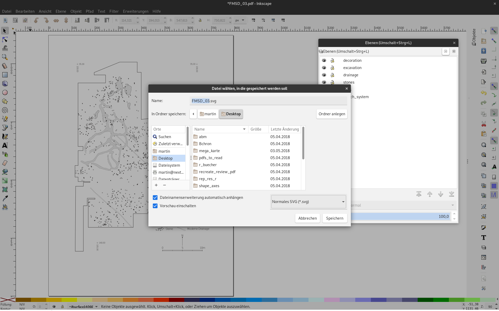
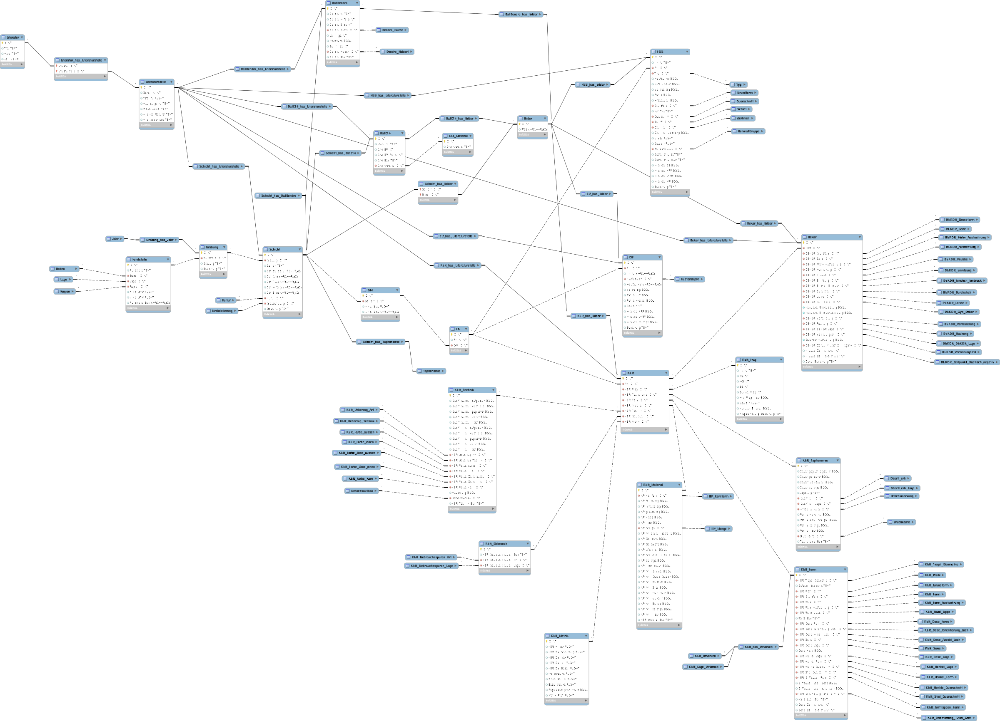

class: title-slide, center, middle
```{r, echo = FALSE}
# https://stackoverflow.com/questions/25646333/code-chunk-font-size-in-rmarkdown-with-knitr-and-latex
def.chunk.hook  <- knitr::knit_hooks$get("chunk")
knitr::knit_hooks$set(chunk = function(x, options) {
  x <- def.chunk.hook(x, options)
  ifelse(options$size != "normalsize", paste0("\\", options$size,"\n\n", x, "\n\n \\normalsize"), x)
})
library(icon)
```

```{r, echo = FALSE, results="asis"}
cat('# ', rmarkdown::metadata$title)
```

```{r, echo = FALSE, results="asis"}
cat('## ', rmarkdown::metadata$subtitle)
```

```{r, echo = FALSE, results="asis"}
cat('### ', rmarkdown::metadata$author)
```

```{r, echo = FALSE, results="asis"}
cat('#### ', rmarkdown::metadata$institute)
```

```{r, echo = FALSE, results="asis"}
cat(rmarkdown::metadata$date)
```

---
## `r icon::fa("window-restore")` Software suggestions

- Office: [Libre Office](https://de.libreoffice.org/)

- Image Processing
  - Raster: [Gimp](http://www.gimp.org/)
  - Vector: [Inkscape](https://inkscape.org/)
  - Digital Photos: [Darktable](https://www.darktable.org/)

- Layout: [Scribus](https://www.scribus.net/)

- Citation Manager: [Zotero](https://www.zotero.org/)

- GIS: [Quantum GIS (QGIS)](http://www.qgis.org/)

- Statistics
  - GUI: [PAST](http://folk.uio.no/ohammer/past)
  - script: [R](https://www.r-project.org/) & [RStudio](https://www.rstudio.com/products/RStudio/)

- 14C Calibration: [OxCal](http://c14.arch.ox.ac.uk/embed.php?File=oxcal.html) (or [Chronomodel](https://chronomodel.com/))

- digitizing charts: [Engauge](http://markummitchell.github.io/engauge-digitizer/)


---
## `r icon::fa("wifi")` Online Ressources

- Translation: [DeepL](https://www.deepl.com)

- file transfer [Firefox Send](https://send.firefox.com/)

- Polls ('doodle'): [dfn terminplaner](https://terminplaner4.dfn.de/)

- literature search:
  - Switzerland: [swissbib](https://www.swissbib.ch/)
  - worldwide: [WorldCat](https://www.worldcat.org/)
  - ancient studies: [Zenon](https://zenon.dainst.org/)

- (fast) online calibration: [CalPal online](http://www.calpal-online.de/)

- 14C Dates: [NeolithicRC](https://neolithicrc.de)

- archaeological data: [Journal of Open Archaeology Data](https://openarchaeologydata.metajnl.com/)


### limited recommendability

- cloud hosting [Dropbox](https://www.dropbox.com)

- Online Office [Google Docs](https://www.google.com/intl/de_ch/docs/about/)

---
## Digital Research Data <sup>*</sup>

.small[
.pull-left[
### `r icon::fa("binoculars")` Observational Data
- Can’t be recaptured
- Examples: sensor readings, observations, survey results

### `r icon::fa("flask")` Experimental Data
- Should be reproducible, but can be expensive
- Examples: gene sequences, microscopy, cell counts

### `r icon::fa("upload")` Derived or compiled Data
- Reproducible, but can be very expensive
- Examples: text and data mining, 3D models
]

.pull-right[
### `r icon::fa("robot")` Simulation Data
- Input can be more important than output data
- Examples: climate models, economic models

### `r icon::fa("book")` Reference Data
- collection datasets, most probably published and/or curated;
- Examples: gene sequence databanks, primary text sources

### `r icon::fa("camera")` Digitised materials
- digitized versions of physical objects
- Examples: digitised manuscripts or other artifacts
]
]

.footnote[.tiny[<sup>*</sup> taken from presentation 'Optimizing your Research Data Management' (Anna Keller, Jennifer Morger & Gero Schreier; Open Science Team Uni Bern)]]

---
## Working with Digital Data <sup>*</sup>

- `r icon::fa("folder")` File structures - *where to put stuff so you won’t lose it*

- `r icon::fa("file-signature")` File naming - *what to call stuff so you know what it is*

- `r icon::fa("code-branch")` Version control - *keeping track of stuff*

- `r icon::fa("file-code")` File formats - *what to save stuff in so it’s safe* .tiny[(Text, Images, Spreadsheets/databases, CAD/GIS, Audio/Video)]

- `r icon::fa("passport")` Documenting data - *letting others understand your data*

- `r icon::fa("recycle")` Selection - *chucking stuff away!*

.footnote[.tiny[<sup>*</sup> adapted from presentation 'Working with Digital Data' (Lindsay Lloyd-Smith 2011)]]

---
## `r icon::fa("folder")` File Structure <sup>*</sup>
### Where to put stuff so you won’t lose it 

.pull-left[
- Logical to you – and easily understandable to others

- Ease of sharing / exchange of data

- Maintaining retrieval of files, e.g. Esri shape files (multiple files)

- Defining the ‘end product’ of a project helps maintain file structure
]

.pull-right[

]

.footnote[.tiny[<sup>*</sup> adapted from presentation 'Working with Digital Data' (Lindsay Lloyd-Smith 2011)]]
---
## Which primary data defines your research?<sup>*</sup>

.pull-left[
### Archaeological material

```{r echo=FALSE, message=F}
library(DiagrammeR)
my_dia <- DiagrammeR::grViz("
digraph material_based {
    graph[overlap=true, splines=true]
    
    node [shape = box,
        fontname = Helvetica]
  'Material Type e.g. Pottery'; 'Site A'; 'Site B'; 'Site C'
  
  'Material Type e.g. Pottery' -> 'Site A'
  'Material Type e.g. Pottery' -> 'Site B'
  'Material Type e.g. Pottery' -> 'Site C'
    
}", height=100, width=400)

my_dia
```
]

.pull-right[
### Location (site based)

```{r echo=FALSE, message=F}
my_dia <- DiagrammeR::grViz("
digraph site_based {
    graph[overlap=true, splines=true]
    
    node [shape = box,
        fontname = Helvetica]
  'Geographical Location'; 'Material A'; 'Material B'; 'Material C'
  
  'Geographical Location' -> 'Material A'
  'Geographical Location' -> 'Material B'
  'Geographical Location' -> 'Material C'
    
}", height=100, width=400)

my_dia
```
]

&nbsp;

- Distinguish between projects.

- Distinguish between sub-folders.

- Define ‘end-product’ of research – and keep clean of temporary folder and files.

- Research designs change and so must file structure.

- Avoid overuse of folders – easier said than done though.

- rule of thumb: 7 subfolders, if more, structure deeper


.footnote[.tiny[<sup>*</sup> adapted from presentation 'Working with Digital Data' (Lindsay Lloyd-Smith 2011)]]


---

## `r icon::fa("file-signature")` File Naming<sup>*</sup>

.pull-left[
What to call stuff so you know what it is

- Names tell us what a file is:	 Contextual information.

- Names order files:		 Making stuff easy to find.

- Define your system:		 **And stick to it.**
]

.pull-right[
.center[

]
.caption[source:https://xkcd.com/1459/]
]

.footnote[.tiny[<sup>*</sup> adapted from presentation 'Working with Digital Data' (Lindsay Lloyd-Smith 2011)]]
---

## `r icon::fa("file-signature")` File Naming<sup>*</sup> (suggestions)

First: Define the types of data and file formats for the research. 
.pull-left[
- Different data may require different naming conventions:
  - Should different data/file formats be identified as part of same project?

- Examples of contextual information in file names: 
  - Date, Author or Initials, Site or Project, Material.

- Capitals in file names affect ordering – be consistent.

]
.pull-right[
- Numbers order files only if zeros are used before units and tens:
  - 001, 002, 003, etc will order files up to 999.
  
- Dates are useful for version control and ordering files.
  - YY-MM-DD (11-03-02) at end of name orders files of same name by year.
  - Year first is good for ordering files, e.g. publication pdfs

- Spaces between file names cause havoc in GIS. Use_underscores

- / Forwardslashes / in file names can cause problems too.

- CAPITALS ARE HARD TO READ!
]

.footnote[.tiny[<sup>*</sup> adapted from presentation 'Working with Digital Data' (Lindsay Lloyd-Smith 2011)]]

---

## `r icon::fa("code-branch")` Version Control<sup>*</sup>
### Keeping track of stuff

It’s surprisingly easy to lose track of the current version of a file.

Especially:
- Word file drafts of thesis chapters.
- Word files commented on by others.
- Multiple-author files sent back and forth by e-mail.
- Graphics and AutoCAD files.

- Be consistent with up-dating file names: version number, initials, date.
- Put old versions in separate “Archive” folder (with date of that version in the folder name)
- Possibly delete old drafts when final version is finished.

.footnote[.tiny[<sup>*</sup> adapted from presentation 'Working with Digital Data' (Lindsay Lloyd-Smith 2011)]]
---
## `r icon::fa("file-code")` File Formats<sup>*</sup>
### What to save stuff in so it’s safe


- Facilitate exchange of data

- Ease of working on different computers / software packages

- Preserve data for re-use in the future

.right[

]
.caption[source:https://roaringelephant.org]

.footnote[.tiny[<sup>*</sup> adapted from presentation 'Working with Digital Data' (Lindsay Lloyd-Smith 2011)]]
---
## `r icon::fa("file-code")` File Formats<sup>*</sup>
### Key Issues

| Open                        | vs | Closed                      |
|-----------------------------|----|-----------------------------|
| Proprietary                 | vs | Open                        |
| Non-Standard                | vs | ISO Standard                |
| non-human readable (binary) | vs | human readable (text based) |
| Compressed                  | vs | Uncompressed                |

.footnote[.tiny[<sup>*</sup> adapted from presentation 'Working with Digital Data' (Lindsay Lloyd-Smith 2011)]]
---
## Text Files<sup>*</sup>

- Manuscripts produced on computers: word files.
  - conference notes, articles, theses, books, etc.

- Scanned printed material often made into a PDF file.
  - Conversion into editable text files using Optical Character Recognition (OCR) software.

- Marked-up formats for viewing as web-pages: HTML

.footnote[.tiny[<sup>*</sup> adapted from presentation 'Working with Digital Data' (Lindsay Lloyd-Smith 2011)]]
---
## Text Files<sup>*</sup>
.footnote[.tiny[<sup>*</sup> adapted from presentation 'Working with Digital Data' (Lindsay Lloyd-Smith 2011)]]

.small[
| Format | Description / Properties                                                                                                                                                         | Usage and Archival Recommendations                                                                                                                                                 |
|--------|----------------------------------------------------------------------------------------------------------------------------------------------------------------------------------|------------------------------------------------------------------------------------------------------------------------------------------------------------------------------------|
| .txt   | Text file.  Simple plain text document. Compatible across software packages. Supports very little formatting.                                                                    | Good for extremely simple files. Commonly used for introductory “Read me” files containing basic information on project archives.                                                  |
| .doc   | Microsoft Word document ( - 2003) Proprietary binary format.  Can be read by OpenOffice. Easily converted into PDF format.                                                       | Accepted for archiving because it is so widely used. However, will soon become obsolete.                                                                                           |
| .docx  | Microsoft Word document (2007) Human readable XML format. Stored along with embedded content as zipped file.                                                                     | Good for dissemination and preservation. Conversion to .doc file to open with earlier versions of MS Word.                                                                         |
| .rtf   | Rich Text Format (Microsoft) Tagged plain text format.                                                                                                                           | Formatting issues when using opened in different software. Large file sizes mean that .docx or .odt  file formats are preferred.                                                   |
| .odt   | Open Document Text (OpenOffice) ISO standard, human readable XML format.                                                                                                         | Open source format good for use, dissemination and archiving. Archive files in uncompressed form. Can open .doc files. Might not open correctly in other word processing programs. |
| .pdf   | Portable Document Format (Adobe) Proprietary binary format. Aims to retain document formatting. Can store embedded data: raster and vector images (e.g. Adobe Illustrator files) | Highly suitable for dissemination. PDF creators and readers freely and widely available. Retain original text document and embedded objects. (e.g. images, tabular data, etc).     |
| PDF/A  | Portable Document Format / Archive (Adobe) Open ISO standard format for long term archiving. Formatting data self-contained in file.                                             | Widely accepted as viable format for long-term archiving. Retain original text file and embedded objects separately. (e.g. images, tabular data, etc).                             |
]

---
## Archiving Text Files<sup>*</sup>
.footnote[.tiny[<sup>*</sup> adapted from presentation 'Working with Digital Data' (Lindsay Lloyd-Smith 2011)]]

- Complete, self explanatory and self contained files.
- Retain embedded data (images, tables) and save in suitable format in a parallel folder.
- No external links to material outside of document.

### Significant Properties of Text Files
- Words and word order.
- Correct script for non-English words.
- Hierarchical structure: headings and sub-headings.
- Formatting: italicised and bold text (but not font type).
- Page numbering.
- Non-text content: images, tabular data stored separately. 

---
## Digital Images<sup>*</sup>
.footnote[.tiny[<sup>*</sup> adapted from presentation 'Working with Digital Data' (Lindsay Lloyd-Smith 2011)]]

- Images are used to convey information and support interpretations.
- Images contain data and are often analysed to reach interpretations.
- Images are one of the most important formats of digital data in archaeology.
- Image documentation and preservation is key for future re-use of project archives.
- Digital images often form the largest part of digital archives.

- **Raster Images:** matrix of dots/pixels containing information (photographs, scans) 
- **Vector Images:** formed by points, lines, polylines, polygons represented by co-ordinates and mathematical formulae (graphic - illustrations, CAD, GIS)

---
## Routes to Rasters<sup>*</sup>
.footnote[.tiny[<sup>*</sup> adapted from presentation 'Working with Digital Data' (Lindsay Lloyd-Smith 2011)]]

- Scanned images of paper illustration or photograph.
- Digitally captured or created: cameras or digitally created illustrations
- Output product of other digital applications: vector, CAD, or GIS work, or geophysical survey data, etc.

- Think of the purpose of image when making it: 
  - screen, print or reference image.
- Formats have different qualities which affect their output use and preservation.

---
## Routes to Rasters<sup>*</sup>
.footnote[.tiny[<sup>*</sup> adapted from presentation 'Working with Digital Data' (Lindsay Lloyd-Smith 2011)]]

.small[
**Resolution** / Level of detail in image:
- Pixels per inch (PPI) or Dots per inch (DPI) or Samples per inch (SPI)
- Bigger the physical size of the picture + increased resolution = bigger file size
- min. 600 dpi for photographs and 300 for illustrations.

**Bit (Colour) Depth** / Level of colour information:
- 2 Bit   = Black/White (line drawings with only black and white needed)
- 8 Bit   = Greyscale
- 24 Bit = Standard colour
- 32 Bit = High colour

**Colour Space** / Type of colour
- Bi-tonal = black/white
- Greyscale
- RGB (Red/Green/Blue) used for screen presentations. Cameras generally capture images in RGB.
- CMYK (Cyan/ Magenta/Yellow /Key [Black]) used for printing colour images.

**Compression**
- Non-compressed (Lossless): GIF, PNG, TIFF.
- Compressed: JPG

Some formats (TIFF, PNG) allow files to be saved as non-compressed.
Important to be aware of when compression is occurring and at what level.

**Image layering**
Layering is NOT supported in final raster image and layers will be merged into a single layer from top down.
]

---
## Raster File Formats<sup>*</sup>
.footnote[.tiny[<sup>*</sup> adapted from presentation 'Working with Digital Data' (Lindsay Lloyd-Smith 2011)]]

.tiny[
| Format        | Description / Properties                                                                                                                                                                                                                               | Recommendations                                                                                                                                                                                                                                                                          |
|---------------|--------------------------------------------------------------------------------------------------------------------------------------------------------------------------------------------------------------------------------------------------------|------------------------------------------------------------------------------------------------------------------------------------------------------------------------------------------------------------------------------------------------------------------------------------------|
| .bmp          | Bit-Mapped Graphics Format  Microsoft proprietary format in older MS applications for simple graphics. Limited embedding of metadata.                                                                                                                  | Not recommended for either working files or long-term file storage.                                                                                                                                                                                                                      |
| .gif          | Graphics Interchange Format Compuserve proprietary format. Lossless compression with 8-bit colour depth (256 colours). Limited metadata.                                                                                                  | Superseded by PNG format, but still widely used for still and animated Web graphics.                                                                                                                                                                                                     |
| **.png**          | Portable Network Graphics. ISO standard. Lossless compression with 32-bit colour depth,  and Alpha channel (transparency), with few ‘visible artefacts’ (cf. jpegs). Does not support EXIF metadata.                                                   | Designed for internet and uses RGB colour space. Standard format for lossless presentation. Use instead of GIF format. NOT recommended long term storage (use TIFF). NOT recommended for digital photographs, as only supports RGB colour.                                |
| **.jpg /  .jpeg** | Joint Photographic Expert Group ISO standard. 32-but colour depth with extremely efficient lossy compression of image. Compression creates ‘visible artefacts’ around complex high-contrast  image areas (e.g. text). Supports EXIF and IPTC metadata. | Designed for photographic or painted images with smooth varying tones that do not have sharp contrast. Much smaller file sizes than PNG or TIFF. While unsuitable for long-term storage, accepted format for archiving digital photographs. |
| **.tif /  .tiff** | Tagged Image File Format (Adobe) Uncompressed image format. Can support range of metadata: EXIF, GeoTIFF for georeferencing.                                                                                                                           | Uncompressed Baseline TIFF Version 6 standard format for long term preservation of  digital figures.                                                                                                                                                                                     |
| .psd          | Photoshop Document (Adobe) Proprietary format and can be used with open Photoshop Elements software. Supports variety of features: image layering, transparency, text. Supports IPTC, EXIF and XMP metadata.                                           | ‘Industry standard’ for image creation. Proprietary nature means limited third-party support for PSD format.  Limited compression results in large file size. Unsuitable for long term preservation. (TIFF for figures or DNG for photographic images.)                                  |
| raw           | Unprocessed bitmap files created by digital cameras and some scanners.   Proprietary, require specific software.  No standardisation in file formats.                                                                                               | If possible, convert raw files to DNG format for long-term preservation.                                                                                                                                                                                                                 |
]

---
## Raster Files<sup>*</sup>
### key points
.footnote[.tiny[<sup>*</sup> adapted from presentation 'Working with Digital Data' (Lindsay Lloyd-Smith 2011)]]

- Think of purpose of image.
- Document rationale of image creation.
- Maintain image documentation: 
- Image properties, file naming and image description file.
- If working with JPEGs, save original as archive and work on copies.
- Save working copies of raster outputs of vector files and replace with final version.

---
## Vector File Formats<sup>*</sup>
.footnote[.tiny[<sup>*</sup> adapted from presentation 'Working with Digital Data' (Lindsay Lloyd-Smith 2011)]]

- Variety of proprietary and open-source software for producing vector images, none of which is recommended for long-term - archiving:
  - Coreldraw (.cdr); Adobe Illustrator (.ai); OpenOffice Draw (.odg).

- Think of purpose of vector files and the output.

Illustrations:
- Save output in high quality TIFF or PNG format.

Files with important vector information:
- Document layer conventions
- Export as SVG file (Scalable Vector Graphics)
- PDF files also holds vector data.

---



---
## CAD & GIS<sup>*</sup>
.footnote[.tiny[<sup>*</sup> adapted from presentation 'Working with Digital Data' (Lindsay Lloyd-Smith 2011)]]

- Used to make figures of real world entities: site plans, maps, building plans, etc. 
- Files comprise layers – turned on or off depending what is required.  


**CAD**	Computer Aided Design	(eg. AutoCAD)
- Developed as technical drafting tool for precise geometric objects.
- Layers connected to data tables – but can not be analysed.


**GIS**	Geographical Information System (eg. QGIS)
- Links graphic objects (points, areas on maps, etc) to associated data tables.
- Geographical analyses can be performed on data tables.

---
## CAD & GIS<sup>*</sup>
.footnote[.tiny[<sup>*</sup> adapted from presentation 'Working with Digital Data' (Lindsay Lloyd-Smith 2011)]]

**Common Data Management Issues**
- Document methods of data caption or collection
- Document terms and conventions used for the layers. 
- Record processes carried out on the data in work log:
  - Date; Process [history function in GIS]; Purpose; Output

**Common Archiving Issues**
- Proprietary software that is not backwardly compatible. Migrate!
- Retain raw survey data.
- Digital exchange formats (DXF, SVG).

---
## Spreadsheets and Databases: Overview<sup>*</sup>
.footnote[.tiny[<sup>*</sup> adapted from presentation 'Working with Digital Data' (Lindsay Lloyd-Smith 2011)]]

**Spreadsheets: **
	Designed on accounting worksheets, primarily for ordering numerical data, performing calculations, and produce charts and figures from data and calculations.

**Databases: **
	Designed to store a wide variety of data (numerical, text, images) and provide complex search and reporting on these data.


**What is important?**
- Data values themselves
- Structure of the tables/sheets used to store
- Structure of relationships between tables in database 

---
## Spreadsheets and Databases<sup>*</sup>
### Data Management

.footnote[.tiny[<sup>*</sup> adapted from presentation 'Working with Digital Data' (Lindsay Lloyd-Smith 2011)]]

**Data consistency**
- Standardised data entry is essential.
- Methods for controlled data entry recommended.
- File and field name and codes need to be documented in separate file.
- Document relationships of database tables (screen shot as jpeg)

**Embedded objects**
- Embedded objects (images, charts, figures) stored separately.
- Document analysis/search procedures from which figures are produced.
- Embedded objects removed from final archived file.

**Non-data content (presentation formatting)**
- Document formatting of tabular data (fonts, colours, cell borders, etc).
- Document data input forms and search query results (‘reports’).

---
## Database structure (MET-Project)

---
## `r icon::fa("passport")` Documentation and Metadata<sup>*</sup>
### Letting others understand your data

.footnote[.tiny[<sup>*</sup> adapted from presentation 'Working with Digital Data' (Lindsay Lloyd-Smith 2011)]]

**Project Documentation**
- Methodology Chapter of Thesis: general information, standards used, etc.
- Introduction / Guide to Appendices: detailed technical information, e.g. explanation of file names and formats used, methods and standards of digital data capture (scanning settings etc).

**Individual File Documentation: embedded or stored separately.**
- Descriptive data on images, audio-visual files, etc.
- Explanation of headings, codes, structure and format of spreadsheets and databases.
- Explanation of vector file layers.

**CAD and GIS Documentation**
- Keep a log of changes to file data and procedures carried out in GIS.

---
## `r icon::fa("recycle")` Selection<sup>*</sup>
### Chucking stuff away!

- Should we keep everything?
- Define the core data which will form the project archive.
- Keep the core data clean.
- Can we keep hold of data that other people send us?
- Chuck stuff away during the project.
- Try not to hoard multiple versions of the same file.
- Store earlier drafts in separate folder as back-up.
- Delete draft documents when file is finalised.
- Draft research proposals may be useful to refer to later.
- What to do with e-mails?

---
class: inverse, middle, center
# Any questions?

.footnote[
.right[
.tiny[
You might find the course material (including the presentations) at

https://github.com/MartinHinz/ca_hs_2019

You can see the rendered presentations at

http://martinhinz.github.io/ca_hs_2019

You can contact me at

<a href="mailto:martin.hinz@iaw.unibe.ch">martin.hinz@iaw.unibe.ch</a>
]
]
]
