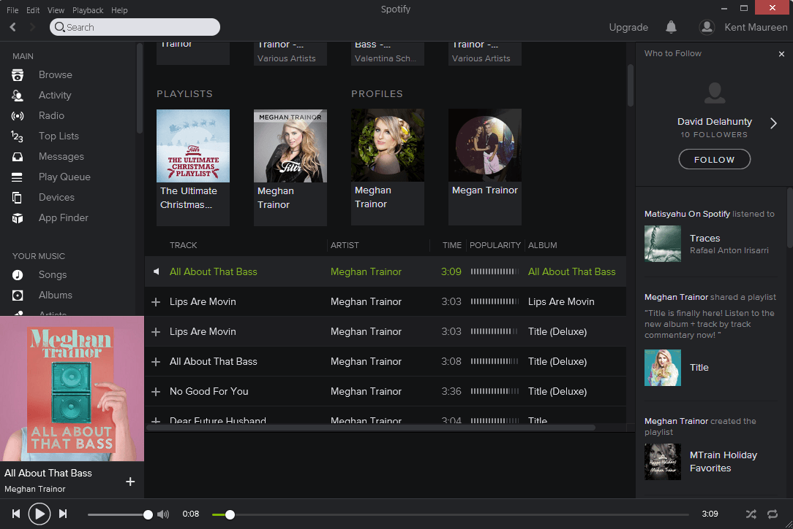
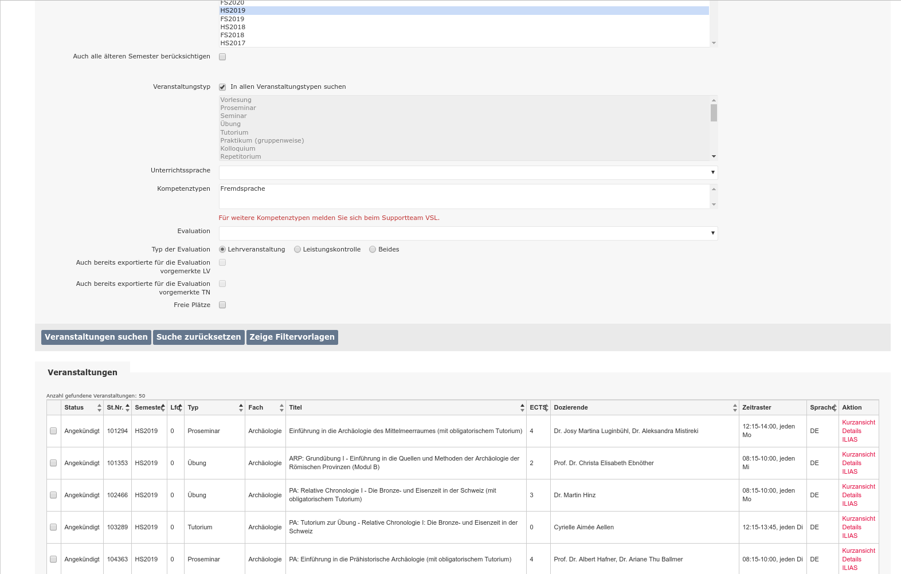
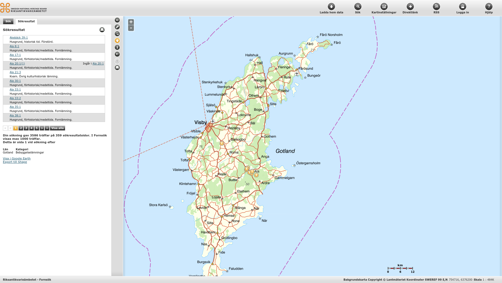
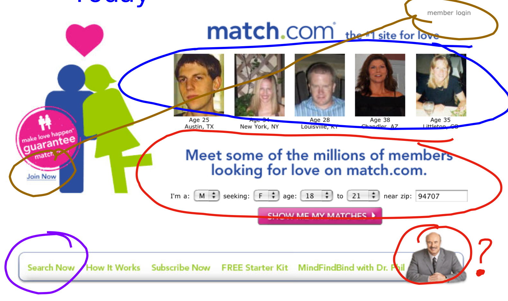
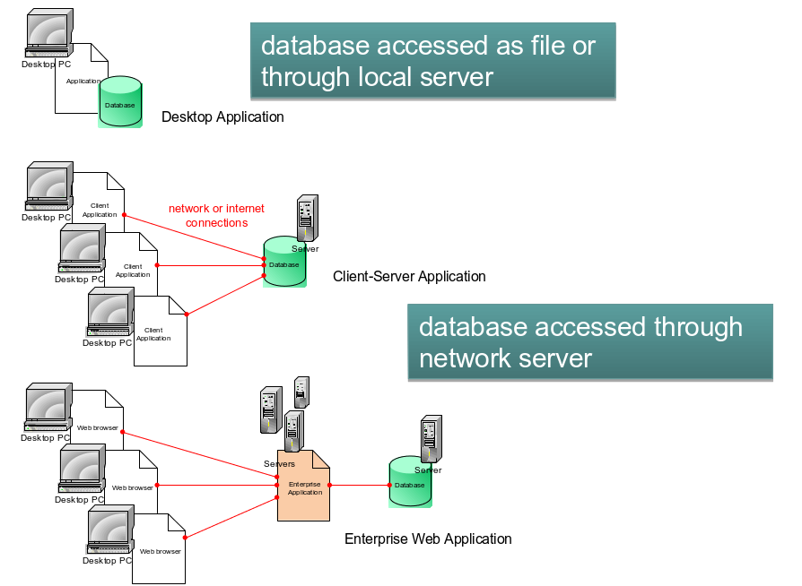
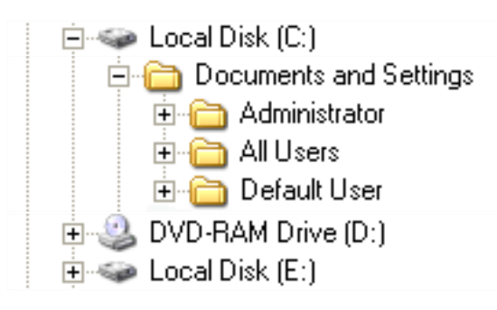
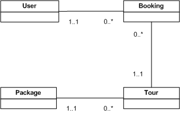

class: title-slide, center, middle
```{r, echo = FALSE}
# https://stackoverflow.com/questions/25646333/code-chunk-font-size-in-rmarkdown-with-knitr-and-latex
def.chunk.hook  <- knitr::knit_hooks$get("chunk")
knitr::knit_hooks$set(chunk = function(x, options) {
  x <- def.chunk.hook(x, options)
  ifelse(options$size != "normalsize", paste0("\\", options$size,"\n\n", x, "\n\n \\normalsize"), x)
})
library(icon)
```

```{r, echo = FALSE, results="asis"}
cat('# ', rmarkdown::metadata$title)
```

```{r, echo = FALSE, results="asis"}
cat('## ', rmarkdown::metadata$subtitle)
```

```{r, echo = FALSE, results="asis"}
cat('### ', rmarkdown::metadata$author)
```

```{r, echo = FALSE, results="asis"}
cat('#### ', rmarkdown::metadata$institute)
```

```{r, echo = FALSE, results="asis"}
cat(rmarkdown::metadata$date)
```

---
## Database then
.pull-left[

.caption[source: https://www.ssa.gov]
]

.pull-right[

.caption[source: https://www.ssa.gov]
]
---
## Database now

.pull-left[

.caption[source: https://lifewire.com]


.caption[source: https://amazon.de]
]

.pull-right[

.caption[source: https://www.ksl.unibe.ch]


.caption[source: http://www.fmis.raa.se]
]

---
## Database now


.caption[source: Hellerstein/Olston 2005, Introduction to Database Systems]

---
## What is a Database?

- A (typically very large) integrated collection of data.
- Typically models a real-world situation:
  - Entities (e.g., teams, games)
  - Relationships (e.g. The A’s are playing in the World Series)
- Computerised database systems are now very commonplace
- Information is stored in a database every time we: 
  - use a bank account
  - book a travel ticket
  - make an appointment with a doctor
  - etc.
- To actually store the data, and to do anything useful with it, you need a Database Management System (DBMS)

---
## DBMS

.pull-left[
- Microsoft Access
  - aimed at small businesses, and useful for desktop applications and systems with a small number of users
- Microsoft SQL Server, Oracle, IDM DB2
  - scalable and professional, and widely used by large organisations
- MySQL, PostgreSQL
  - open-source and quite powerful, widely used in web sites
- JavaDB, SQLite
  - compact DBMSs, suitable for mobile devices in particular
- ...and many more
]

.pull-right[

.caption[source: Paterson, Introduction to Database Development]
]
---
## Data models

- The way in which data is organised for storage in a database is known as the data model 
- Early computer databases developed in the 1960’s used a hierarchical model, similar to the way files and folders are still organised in computer file systems
- Most data does not fit very well into a simple hierarchy

.pull-left[
Hierarchical data

.caption[source: Paterson, Introduction to Database Development]
]

.pull-right[
“Real-world” data – no clear hierarchy

.caption[source: Paterson, Introduction to Database Development]
]

- Relatively complex data like this is better handled with the relational model
- Most databases nowadays are relational databases
  - although there are others: object databases, XML databases, “NoSQL” databases

---
class: inverse, middle, center
# Any questions?

.footnote[
.right[
.tiny[
You might find the course material (including the presentations) at

https://github.com/MartinHinz/ca_hs_2019

You can see the rendered presentations at

http://martinhinz.github.io/ca_hs_2019

You can contact me at

<a href="mailto:martin.hinz@iaw.unibe.ch">martin.hinz@iaw.unibe.ch</a>

Sources for the slides:

'Introduction to Database Systems' (Hellerstein/Olston 2005)
'Introduction to Database Development' (Paterson)
]
]
]
