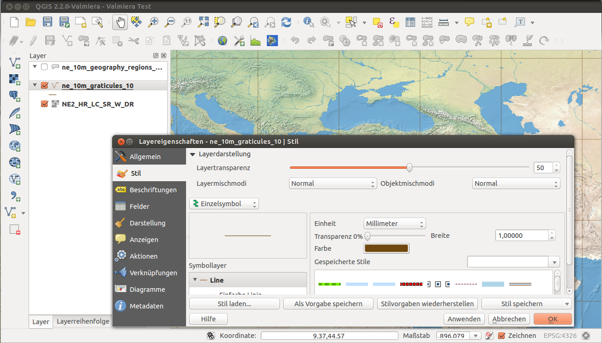
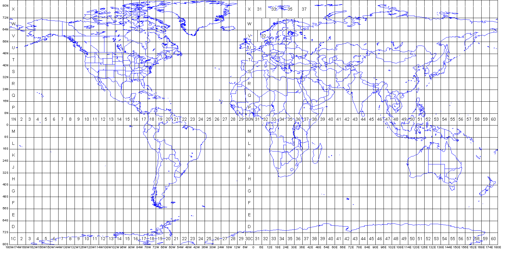

class: title-slide, center, middle
```{r, echo = FALSE, warning=F, message=FALSE}
# https://stackoverflow.com/questions/25646333/code-chunk-font-size-in-rmarkdown-with-knitr-and-latex
def.chunk.hook  <- knitr::knit_hooks$get("chunk")
knitr::knit_hooks$set(chunk = function(x, options) {
  x <- def.chunk.hook(x, options)
  ifelse(options$size != "normalsize", paste0("\\", options$size,"\n\n", x, "\n\n \\normalsize"), x)
})
library(magrittr)
library(kableExtra)
```

```{r, echo = FALSE, results="asis"}
cat('# ', rmarkdown::metadata$title)
```

```{r, echo = FALSE, results="asis"}
cat('## ', rmarkdown::metadata$subtitle)
```

```{r, echo = FALSE, results="asis"}
cat('### ', rmarkdown::metadata$author)
```

```{r, echo = FALSE, results="asis"}
cat('#### ', rmarkdown::metadata$institute)
```

```{r, echo = FALSE, results="asis"}
cat(rmarkdown::metadata$date)
```
---
## GIS [1]

.pull-left[

> A geographic information system (GIS) is a system designed to capture, store, manipulate, analyze, manage, and present spatial or geographic data. - Wikipedia

]

.pull-right[

]
---
## GIS [2]


---
## What can we do with a GIS?


---
## QGIS

- a free and open source GIS software
- https://www.qgis.org/
- If you not have already installed QGIS, please do now!

.center[

]

.right[

]

---
## Raster vs. Vector

.pull-left[

]
.pull-right[

]

---
## Lat/long system

.pull-left[
Lat/long system measures angles on spherical surfaces

* 60º east of PM
* 55º north of equator

* Lat/long values are NOT Cartesian (X, Y) coordinates
* constant angular deviations do not have constant distance deviations
* 1° of longitude at the equator ≠ 1° of longitude near the poles
]

.pull-right[

]

---
## Coordinate Systems

.pull-left[
- Features on spherical surfaces are not easy to measure
- Features on planes are easy to measure and calculate
  - distance
  - angle
  - area
- Coordinate systems provide a measurement framework
]

.pull-right[

]

---
## Coordinate Systems and Projection [1]

.pull-left[

]
.pull-right[

]

---
## Coordinate Systems and Projection [2]

.pull-left[
- an imaginary light is “projected” onto a “developable surface” 
- a variety of different projection models exist
- Map projections always introduce error and distortion
]

.pull-right[

]

---
## UTM

.pull-left[
Universal Transverse Mercator (UTM)

- Based on the Transverse Mercator projection
- 60 zones (each 6° wide)
- false eastings
- Y-0 set at south pole or equator
]

.pull-right[

]

---
## Schweizer Landeskoordinaten

.pull-left[
- a geographic coordinate system used in Switzerland for maps and surveying by the Swiss Federal Office of Topography (Swisstopo)
- The map projection used is Oblique Mercator on an 1841 Bessel ellipsoid.
- All coordinates are always positive, since Switzerland is located in the 1st quadrant of the coordinate system.
]

.pull-right[

]
---
## Datums and Ellipsoids

.pull-left[
- The earth is essentially a potatoe...
- Ellipsoids are geometric estimations of the shape of the earth with more or less accurary
- a datum is a system that allows us to place a coordinate system on the earth’s surface based on a specific ellipsoid
- examples:
  - WGS84 (Lat/Lng, UTM)
  - Bessel 1841 (Schweizer Landeskoordinaten)
]

.pull-right[

]

---
## Georeferencing


Download original file: [miskovice_overview.png](miskovice_overview.png)

Background openstreetmap: https://tile.openstreetmap.org/{z}/{x}/{y}.png

coordinate system wgs84/pseudo-mercator (EPSG: 3857)
---
## Digitising

download the georeferenced files:

- [miskovice_overview_modified.tif](miskovice_overview_modified.tif)
- [miskovice_a-d_modified.tif](miskovice_a-d_modified.tif)
- [miskovice_e_modified.tif](miskovice_e_modified.tif)
- [miskovice_f_modified.tif](miskovice_f_modified.tif)

Make a new shape layer (points)

Start digitising and save layer

---
## Changing design

load shape file(s):
- [miskovice_graves_shp.zip](miskovice_graves_shp.zip)
- extract
- Layer > Add Layer > Add Vector Layer

right click on layer > Properties > Symbology

---
## Heatmap

right click on layer > Properties > Symbology > Heatmap

---
## Thematic map (1:1 Relationship)

- import csv-file (add Delimited Text layer)
- join attribute table with geolocations
- visualise (via symbology)

---
## Thematic map (1:m Relationship)

- import csv-file
- create virtual layer
- sql join 
  - `select * from miskovice_graves left join miskovice_types_per_graves on miskovice_graves.id == miskovice_types_per_graves.grave_number`
- visualise (via symbology)

---
## Exporting

right click on layer > Export > Save features as...

- shp
- csv
  - geometry ('AS_XY')

---
## Importing

Layer > Add Layer > Add Delimited Text Layer

---
## Exporting maps

Project > New print Layout

- add map
- add north arrow
- add scalebar
- export as Image
- export as PDF

---
class: inverse, middle, center
# Any questions?

.footnote[
.right[
.tiny[
You might find the course material (including the presentations) at

https://github.com/MartinHinz/ca_hs_2019

You can see the rendered presentations at

http://martinhinz.github.io/ca_hs_2019

You can contact me at

<a href="mailto:martin.hinz@iaw.unibe.ch">martin.hinz@iaw.unibe.ch</a>

Sources for the slides:

* Steiniger 2009, Free and Open Source Desktop GIS Projects and Software
* Briggs 2019, GIS Fundamentals
* Leeds, Raster GIS
* Lawler/Schiess 2010, Projections and Coordinate Systems
]
]
]
