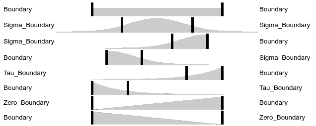
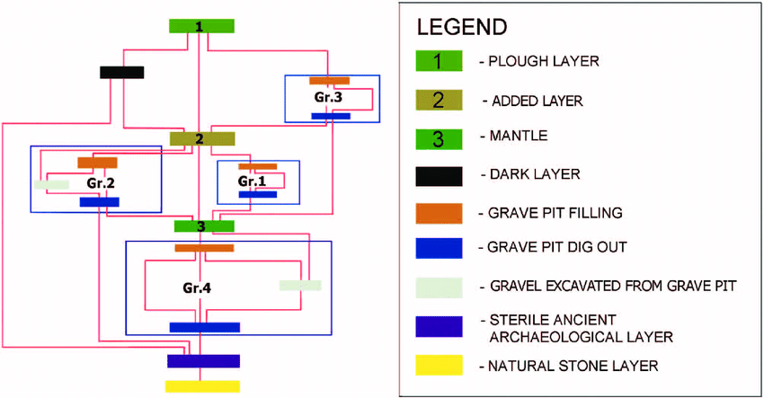

class: title-slide, center, middle
```{r, echo = FALSE, warning=F, message=FALSE}
# https://stackoverflow.com/questions/25646333/code-chunk-font-size-in-rmarkdown-with-knitr-and-latex
def.chunk.hook  <- knitr::knit_hooks$get("chunk")
knitr::knit_hooks$set(chunk = function(x, options) {
  x <- def.chunk.hook(x, options)
  ifelse(options$size != "normalsize", paste0("\\", options$size,"\n\n", x, "\n\n \\normalsize"), x)
})
library(magrittr)
library(kableExtra)
```

```{r, echo = FALSE, results="asis"}
cat('# ', rmarkdown::metadata$title)
```

```{r, echo = FALSE, results="asis"}
cat('## ', rmarkdown::metadata$subtitle)
```

```{r, echo = FALSE, results="asis"}
cat('### ', rmarkdown::metadata$author)
```

```{r, echo = FALSE, results="asis"}
cat('#### ', rmarkdown::metadata$institute)
```

```{r, echo = FALSE, results="asis"}
cat(rmarkdown::metadata$date)
```
---
## OxCal
### Project

.pull-left[
- File > New
- Insert R_Date
  - Name
  - 14C Date
  - Uncertainity

### Dates
- Grab 29 (UtC 13189) 3671 ± 33 BP
- Grab 20 (UtC-13187) 3600 ± 38 BP
- Grab 31 (UtC-13190) 3560 ± 36 BP
- Grab 42 (UtC-13192) 3559 ± 41 BP
- Grab 18 (UtC-13186) 3531 ± 40 BP
- Grab 32 (UtC-13191) 3521 ± 37 BP
- Grab 27 (UtC-13188) 3409 ± 38 BP

File > Run
]

.pull-right[

]

---
## OxCal
### Results


.pull-left[
- Table
- Single Plot
- Multi-Plot (not very useful yet)
- Curve plot
- Raw Data
]

.pull-right[

]

---
## OxCal
### Combine

.pull-left[
If a single process can be more accurately dated by several dates:
- e.g. the dating of a single grave can be estimated more precisely, if more than one date of the buried person (equal to - body!) is present
- Same event - multiple dates for it
- Works without Bayes: Assumption: The dates of dating all should be equal (Bayes gets even better...)

**Attention**: Never combine if you are not sure that there are the event is actually one and the same (Simultaneity!)
]

.pull-right[

```{r, eval=FALSE}
Combine("C")
{
 R_Date("A",2000,20);
 R_Date("B",2020,30);
};
```
]


---
## OxCal
### Duration of the Burial Ground


.pull-left[
- Phase
- Sequence
- Boundaries
]

.pull-right[

```{r eval=F}
Sequence()
    {
     Boundary("S");
     Phase()
     {
      R_Date("A",3050,25);
      R_Date("B",3010,25);
      R_Date("C",3020,25);
      R_Date("D",3000,25);
     };
     Boundary("E");
    };
```
]
---
## OxCal
### Duration of the Burial Ground, adding Queries


.pull-left[
- First();
- Last();
- Span();
]

.pull-right[

```{r eval=F}
Sequence()
    {
     Boundary("S");
     Phase()
     {
      R_Date("A",3050,25);
      R_Date("B",3010,25);
      R_Date("C",3020,25);
      R_Date("D",3000,25);
      First();
      Last();
      Span();
     };
     Boundary("E");
    };
```
]
---
## OxCal
### Types of Boundaries
.pull-left[
- Boundary([Name], [Expression]);
- Sigma_Boundary([Name], [Expression]);
- Tau_Boundary([Name], [Expression]);
- Zero_Boundary([Name], [Expression]);

Also interesting: Trapezoidal boundaries for gradual transition (eg. cultural phases)

```{r eval=F}
Boundary("MidStart")
     {
      Transition("Duration Start");
      Start("Start Start");
      End("End Start");
     };
```


]

.pull-right[



]
---
## OxCal
### Adding Stratigraphical Informations


.pull-left[
- what is sequential: Sequence
- what can not be sequenced: Phase

]
.pull-right[

]
---
## OxCal
### Adding Stratigraphical Informations

You can make this arbitrary complicated!

.pull-left[

]

.pull-right[

]
---
## OxCal
### Adding Stratigraphical Informations


.pull-left[
- what is sequential: Sequence
- what can not be sequenced: Phase

### 14C dates
- Grab 29 (UtC 13189) 3671 ± 33 BP
- Grab 20 (UtC-13187) 3600 ± 38 BP
- Grab 31 (UtC-13190) 3560 ± 36 BP
- Grab 42 (UtC-13192) 3559 ± 41 BP
- Grab 18 (UtC-13186) 3531 ± 40 BP
- Grab 32 (UtC-13191) 3521 ± 37 BP
- Grab 27 (UtC-13188) 3409 ± 38 BP
]
.pull-right[

]

---
## OxCal
### Further possible topics

- wiggle matching (gap)
- sum calibration (sum)
- outlier analysis (Outlier & Outlier_Model)
- Deposition models (D_Sequence, V_Sequence, P_Sequence, U_Sequence, )

more at the [OxCal help page](https://c14.arch.ox.ac.uk/oxcalhelp/hlp_contents.html)
---
class: inverse, middle, center
# Any questions?

.footnote[
.right[
.tiny[
You might find the course material (including the presentations) at

https://github.com/MartinHinz/ca_hs_2019

You can see the rendered presentations at

http://martinhinz.github.io/ca_hs_2019

You can contact me at

<a href="mailto:martin.hinz@iaw.unibe.ch">martin.hinz@iaw.unibe.ch</a>
]
]
]
